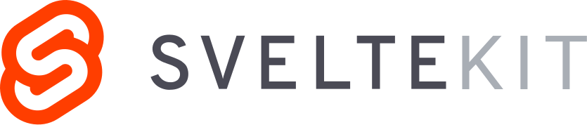

# Was sind Metaframeworks?

<template v-slot:fakt-1>

## ENHANCE
Ein Meta-Framework baut auf einem bestehenden Framework auf und erweitert dessen Funktionalität.
</template>

<template v-slot:fakt-2>

## EXTEND
Es bietet zusätzliche Tools, Abstraktionen und Optimierungen, die über die Möglichkeiten des Basis-Frameworks hinausgehen.
</template>

<template v-slot:fakt-3>

## EMPOWER
Es soll die Entwicklung zu vereinfachen, die Leistung zu verbessern und neue Funktionen bereitzustellen, ohne das Grundframework zu ersetzen.

</template>

<!--
Ein Metaframework baut auf einem bestehenden Framework auf und erweitert dessen Funktionalität. Es fügt also zusätzliche Tools, Abstraktionen und Optimierungen hinzu, die über die Möglichkeiten des Basisframeworks hinausgehen.

Das Ziel ist es, die Entwicklung zu vereinfachen, die Leistung zu verbessern und neue Funktionen bereitzustellen, ohne das zugrunde liegende Framework komplett zu ersetzen.

Anstatt also das Grundframework wie Angular komplett auszutauschen, ermöglicht ein Metaframework wie Analog, die bestehenden Stärken von Angular zu nutzen und gleichzeitig die Entwicklungserfahrung und Performance der Anwendungen weiter zu verbessern.
-->
